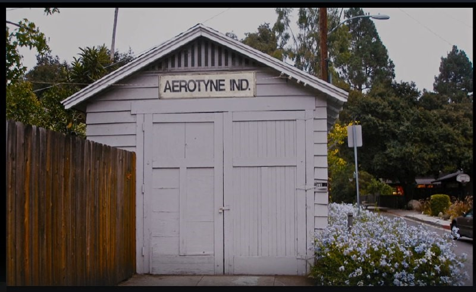

# ПРОЕКТНАЯ РАБОТА. РАЗРАБОТКА САЙТА О КИНО “САНЧЕЗ И АНДРЮХА ПРЕДСТАВЛЯЮТ…”

## ОПИСАНИЕ ПРОЕКТА

*Самый крутой, технологически-развитый сайт, осуществляющий подачу информации людям исключительно в развлекательных целях. Мы представляем лучшее качество видео и дорожки озвучки. С нас брали пример такие знаменитые сервисы, как “Кинопоиск”, “Иви”, и “Netflix”, “Amazon” и другие.*

*Если серьёзно перед проектом поставлена задача морально обогатить зрителя и подарить только позитивные и запоминающиеся эмоции. Ведь, согласитесь, не хотелось бы вам тихим, спокойным вечером посмотреть вдохновляющие и интригующее кино? Таким образом, бокал красного терпкого вина или прохладная пинта ирландского пива с ледяной рюмочкой ягермейстера откроют вам новый мир фантастики, которая может родиться в ваших загруженных мыслях и тяжёлых сердцах!*

*Отпустите прошлое, простите все обиды, уделите время себе и найдите своё состояние тонкой душевной гармонии на ярчайших афишах наших кинолент. И самое главное – не сомневайтесь, вы сделали правильный выбор!*

## СПРИНТ 1. Создание базы данных

**Стек: PostgreSQL-16, Ruby 3.2.0, Rails 8.0.1, PHP-8, 1C-Битрикс**

### 1. Подготовка к загрузке данных  

Создать схему данных
Подключить gem 'KinopoiskAPI'.   
Создать модели, выполнить миграции.  

### 2. Загрузка данных

Создать контролллер, добавить вызов view:

  - film = KinopoiskAPI::Film.new(film_id)
  - film_data = film.view # Получение подробной информации о фильме

Загрузить данные в таблицы (выполнить запрос INSERT).

## СПРИНТ 2. Импорт данных в 1С-Битрикс

### 1. Развёртывание

Развернуть 1С-Битрикс

### 2. Импортировать данные о фильмах, в базу данных полдюченную к 1С-Битрикс

Создать скрипт для импорта данных.

## СПРИНТ 3.

**Стек: html, css, js**

### 1. Сверстать главную страницу

Необходимо создать html вёрстку со списком фильмов.

### 2. Сверстать детальную страницу

Необходимо создать html вёрстку со детальной страницой фильма.

## СПРИНТ 4.

**Стек: PHP 8, 1С-Битрикс (редакция стандарт), MYSQL-8**

### 1. Интегрировать вёрстку главной страницы

Необходимо создать шаблон сайта. Создать 404 страницу и  шаблон компонента news.list, для вывода списка фильмов.

### 2. Интегрировать вёрстку детальной страницы

Необходимо создать шаблон компонента news.detail, для детальной страницы.

## РЕГЛАМЕНТ РАБОТЫ С GIT
[Репозиторий проекта](https://github.com/AndreySamoylov/tsip_site)

Главная ветка – main. От неё нужно создать свои ветки. Свои ветки называть осмысленно, например, основываясь на задаче. После окончания работы создавать pull request в ветку main.
